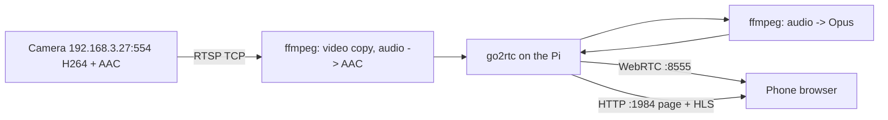

# Raspberry Pi local apps

LAN host: Raspberry Pi at `192.168.3.42` (Debian 13, aarch64).

On the same Wi-Fi, names end in `.local` (mDNS). Caddy on port 80 routes each name to an app. HTTPS is off on purpose: Let's Encrypt cannot issue certificates for `.local`.

| Open | Goes to |
| --- | --- |
| **http://camera.local/** | Camera viewer |
| **http://budget.local/** | Family budget |
| **http://pi.local/** | App list (also `http://192.168.3.42/` and `http://raspberrypi.local/`) |
| `http://192.168.3.42:1984/` | Camera, bypassing the proxy |

Quiet hours (Moscow time): LAN apps stop at **01:00** and start at **08:00**. This Pi 4 has no RTC, so it cannot power itself off and back on; SSH stays up. Install with `sudo apps/quiet-hours/install.sh`.

To add another app (example `lights.local`):

1. Run it on a local port on the Pi.
2. Uncomment/copy a `handle` block in [`apps/gateway/Caddyfile`](apps/gateway/Caddyfile).
3. Add the name to [`apps/gateway/mdns-names.txt`](apps/gateway/mdns-names.txt).
4. Add a card on [`apps/gateway/www/index.html`](apps/gateway/www/index.html).
5. `sudo systemctl reload caddy && sudo systemctl restart avahi-daemon`

Install/update the gateway:

```bash
cd apps/gateway
sudo ./install.sh
```

## Camera viewer (browser)

Watch the RTSP camera with video and audio from a phone or laptop browser on the LAN. Browsers cannot open RTSP directly, so [go2rtc](https://github.com/AlexxIT/go2rtc) runs on the Pi, pulls the camera over RTSP TCP, and serves WebRTC (with HLS/MSE/MJPEG fallbacks) to the browser.

Camera: `rtsp://192.168.3.27:554/live/ch00_0` — H264 1280x720 20 fps, AAC 16 kHz mono.

### Watch it

Phone or laptop on the same LAN: **http://camera.local/**  
(Direct: `http://192.168.3.42:1984/`)

Tap **Unmute** for sound (browsers block autoplay with audio). **Fullscreen** is next to it.

- go2rtc stream API: `http://192.168.3.42:1984/api/streams`
- Still image: `http://192.168.3.42:1984/api/frame.jpeg?src=cam`
- A different stream name: `http://192.168.3.42:1984/?src=<name>`

### How it is wired



Three sources are generated into `go2rtc.yaml`:

| Source | Why |
| --- | --- |
| `ffmpeg:<url>#video=copy#audio=aac` | Main feed. Video is copied (no CPU cost). The camera's raw AAC makes Chrome's MSE demuxer fail with `CHUNK_DEMUXER_ERROR_APPEND_FAILED`, so ffmpeg re-encodes just the audio. |
| `ffmpeg:cam#audio=opus` | WebRTC cannot carry AAC, so audio is transcoded to Opus for the low-latency path. |
| `ffmpeg:cam#video=mjpeg` | Only for `/api/frame.jpeg` snapshots and the MJPEG fallback. |

The browser page is a thin wrapper around go2rtc's own `video-rtc.js` player, vendored into `apps/camera-viewer/www/` because setting `static_dir` replaces go2rtc's built-in web assets.

### Install on the Pi

Copy `apps/camera-viewer` to the Pi, then:

```bash
cd apps/camera-viewer
sudo ./install.sh
```

The installer installs `ffmpeg` and `curl`, downloads the matching `go2rtc` binary, creates `config.env` if missing, and enables `camera-viewer.service` to start on boot.

Currently installed at `/home/longlom/rasp/apps/camera-viewer` and running as user `longlom`.

To redeploy after local edits:

```bash
rsync -az --exclude bin/ --exclude config.env --exclude go2rtc.yaml \
  apps/camera-viewer/ longlom@192.168.3.42:/home/longlom/rasp/apps/camera-viewer/
ssh longlom@192.168.3.42 'sudo systemctl restart camera-viewer'
```

Keep SSH passwords out of this repo; set up an SSH key instead.

### Config

`apps/camera-viewer/config.env` (gitignored, created from `config.env.example`):

| Variable | Purpose |
| --- | --- |
| `RTSP_URL` | Camera URL |
| `RTSP_TRANSPORT` | `tcp` (default) or `udp` |
| `HTTP_LISTEN` | Web UI port, default `:1984` |
| `WEBRTC_LISTEN` | WebRTC UDP port, default `:8555` |
| `WEBRTC_CANDIDATE` | Pi address advertised to browsers, `192.168.3.42:8555` |
| `STREAM_NAME` | Stream id, default `cam` |
| `RESTART_DELAY` | Seconds before restarting go2rtc after an exit |

`run.sh` regenerates `go2rtc.yaml` from `config.env` on every start, so edit `config.env` and restart:

```bash
sudo systemctl restart camera-viewer
```

### Troubleshooting

- **Logs:** `journalctl -u camera-viewer -f`
- **Camera itself:** on the Pi, `ffplay -rtsp_transport tcp rtsp://192.168.3.27:554/live/ch00_0`, or `ffprobe -rtsp_transport tcp rtsp://...` to see codecs.
- **Page loads but stays black:** the overlay in the top right shows the active mode (`RTC`, `MSE`, `HLS`). If it stays on `loading`, check `journalctl`.
- **Works on laptop, black on phone:** `WEBRTC_CANDIDATE` must be the Pi address the phone can reach. The player falls back to MSE/HLS over port 1984 if WebRTC cannot connect, so make sure that port is open too.
- **No sound:** tap Unmute. WebRTC audio is Opus; HLS/MSE audio is the re-encoded AAC.
- **Pi IP changes:** update `WEBRTC_CANDIDATE` in `config.env` and restart. A DHCP reservation for the Pi avoids this.
- **Recovery:** If the camera is powered off, the page and a background probe wait 5 minutes between checks, then start the stream when it comes back. `run.sh` also restarts go2rtc if it exits.

### Verified

Camera pipeline, web page, WebRTC (H264 + Opus, packets confirmed arriving), HLS playlist, JPEG snapshot, and boot-time enablement were all tested against the live camera on the Pi.

## Family budget

Phone: **http://budget.local/**

Tracks four pots: **10%** (10% of every income, extra confirm to spend), **everyday**, **savings bank**, **USD cash**. USD buys are conversions, not spending.

Each month shows: into 10%, managed to save (10% + savings + local spent on USD), and spent (expenses). Opening balances can be seeded once under **Balances**.

```bash
cd apps/budget
sudo ./install.sh
cd ../gateway
sudo ./install.sh
```

SQLite lives in `apps/budget/data/budget.sqlite` (gitignored). Currency default is `RUB` in `config.env`.
